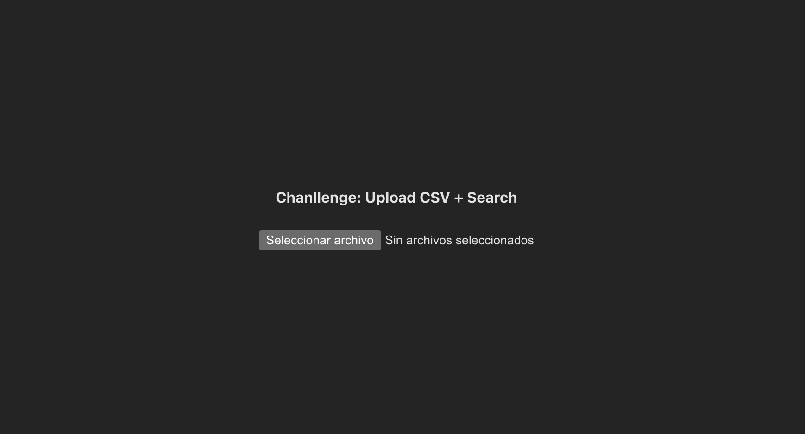
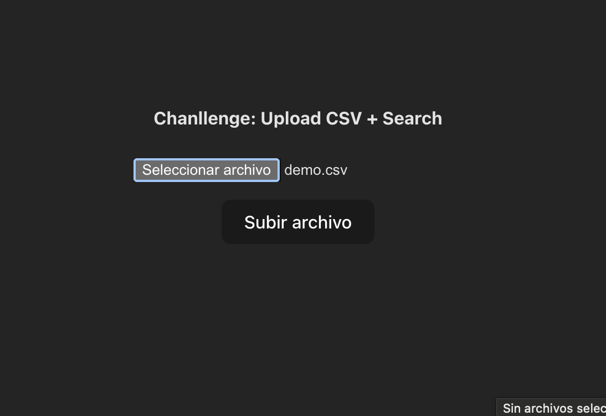
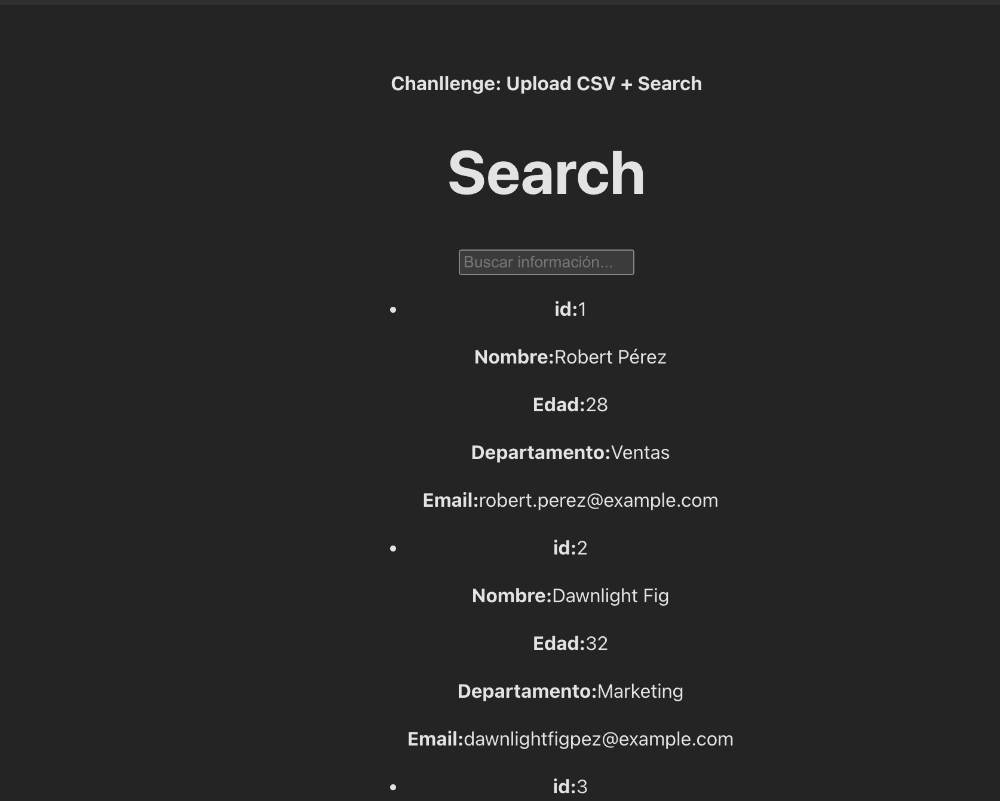
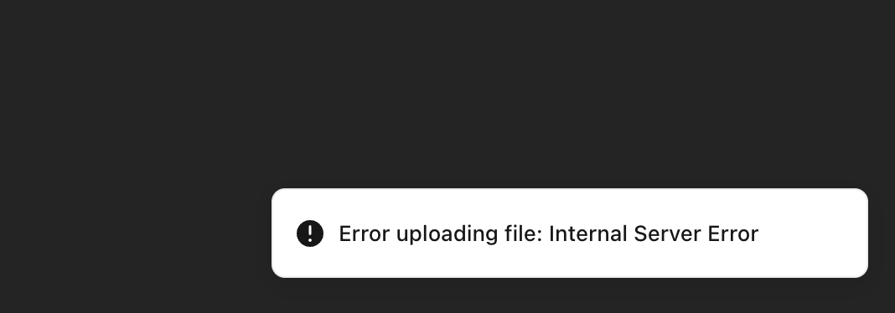
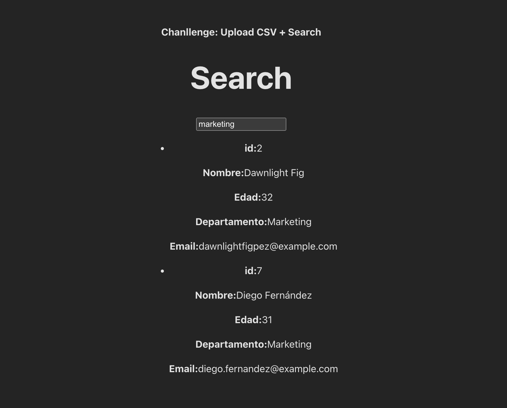

# Challenge: Upload CSV + Search

## React-Notas Monorepo

Este monorepo está compuesto por dos partes principales: Backend y Frontend. A continuación, se detallan las características y tecnologías de cada una.

### Backend

El backend está desarrollado utilizando:

	•	Node.js
	•	Express.js
	•	TypeScript

El backend tiene dos endpoints principales:

    1. Subida de Archivos: Permite subir un archivo .csv y, por el momento, guarda su contenido en memoria.
	2. Filtro de Búsqueda: Permite realizar búsquedas filtradas en los datos cargados.

**Características:**
	•	Se utiliza Express.js para gestionar las rutas y peticiones.
	•	TypeScript para mayor tipificación y escalabilidad.
	•	Manejo de Archivos: Los archivos .csv se suben y se procesan en memoria por ahora.

### Frontend

El frontend está desarrollado utilizando:

	•	React
	•	Vite
	•	TypeScript
	•	SWC (para una compilación más rápida de TypeScript)

El frontend se encarga de la interacción con el usuario y el consumo de la API del backend. Este proyecto sigue los principios de una Single Page Application (SPA).

***Características:***

	•	Un formulario para subir archivos .csv.


	•	Manejo de Estados: El estado del filtro de búsqueda se actualiza dinámicamente en la vista.


	•	Consumo del API Backend: Los resultados de la búsqueda se obtienen mediante llamadas al backend.

  

	•	Manejo de Errores: Se utiliza la librería Sonner para mostrar notificaciones de errores y éxito.


	•	Variables de Entorno: Se utilizan variables de entorno con el prefijo VITE_ para manejar las URLs de los endpoints sin exponerlas al frontend.

	•	Debounce en Busquedas: Se utiliza el hook useDebounce para evitar saturar el backend con múltiples llamadas de búsqueda en corto tiempo.



### Ejecución del Proyecto

Ambas partes, Backend y Frontend, se ejecutan con un solo comando desde la raíz del monorepo:

``` npm run dev ```

Este comando ejecutará ambos ambientes en paralelo.

Trabajo Futuro

Hay varias tareas pendientes para mejorar y completar el proyecto:

	•	Implementar Base de Datos para almacenar los archivos y resultados de las búsquedas.
	•	Realizar Tests para garantizar el funcionamiento correcto de ambas partes (Backend y Frontend).
	•	Estilos y Diseño: Mejorar el diseño visual del frontend y realizar una adecuada componetización en React.
	•	Validaciones en Backend: Implementar validaciones usando librerías como Zod para asegurar que los datos ingresados sean correctos.